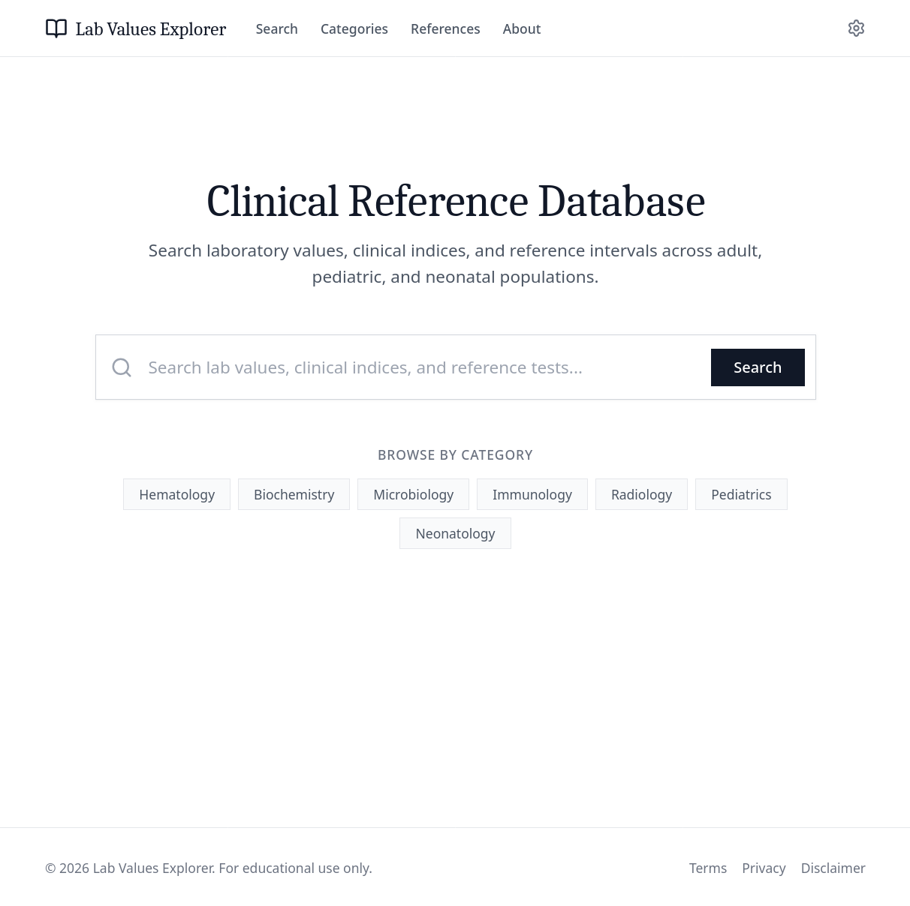
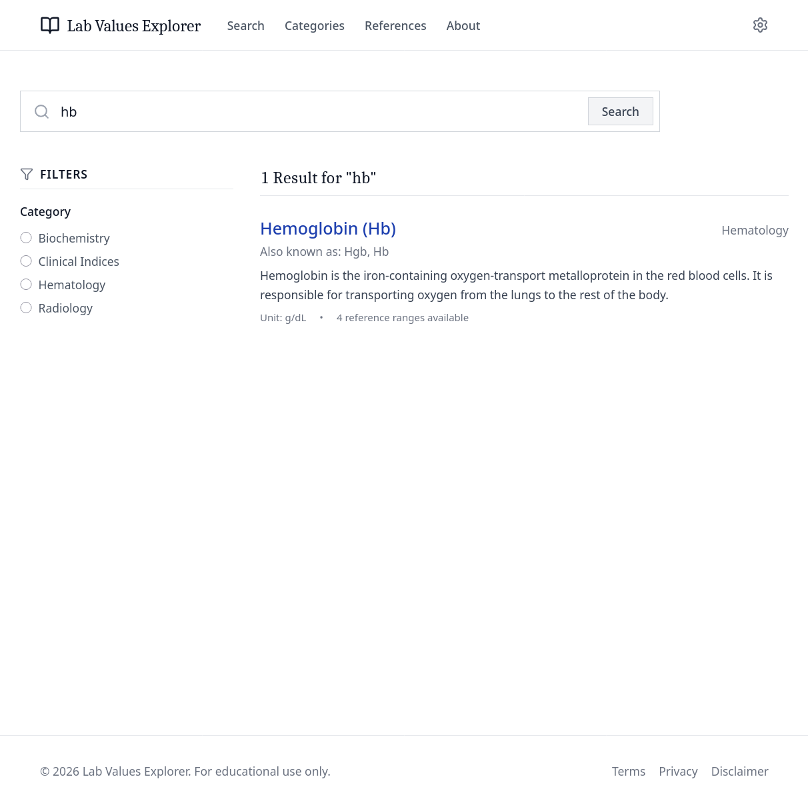
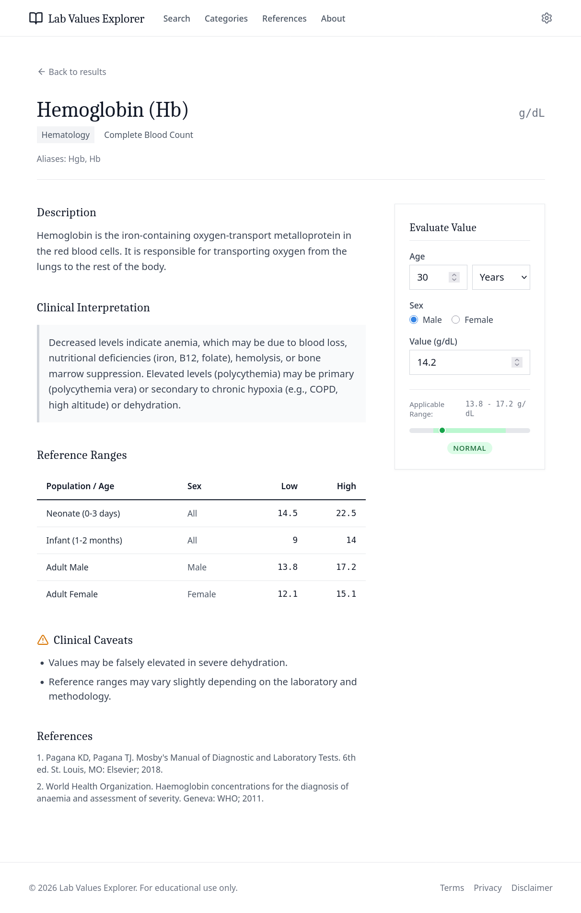

# 🧪 Lab Values Explorer

> A polished clinical reference database for exploring lab values, reference intervals, and interpretation notes.
> Built to help users browse adult, pediatric, and neonatal reference data in a clean, searchable interface.

<p align="left">
  
  
  
  
  
  
  
</p>

---

## Overview

**Lab Values Explorer** is an educational clinical reference app for searching and reviewing lab-related data in a structured, easy-to-scan format.

It provides curated entries for laboratory values and clinical indices, with:

* searchable descriptions,
* aliases and categories,
* age- and sex-aware reference ranges,
* interpretation notes,
* clinical warnings,
* references, examples, and practical notes.

The dataset included in this project covers **adult, pediatric, and neonatal populations** where applicable.

---

## ✨ Features

* 🔎 **Fast lab search** — search by lab name, alias, or description.
* 🗂️ **Category browsing** — filter results by category from the search page.
* 🧬 **Clinical detail pages** — open a full record for each lab value.
* 👶 **Age-aware reference ranges** — supports hours, days, weeks, months, and years.
* ⚧️ **Sex-specific evaluation** — range matching can account for patient sex when provided.
* 📏 **Value assessment tool** — enter a lab value to see whether it is low, normal, or high against the applicable range.
* ⚠️ **Clinical caveats** — built-in warnings and interpretation notes are shown per record.
* 📚 **Reference sections** — each entry includes sources, examples, and notes.
* 🎛️ **Settings UI** — a dedicated preferences screen is included in the app.
* ⚡ **SPA navigation** — routed with `HashRouter`, making it friendly for static hosting such as GitHub Pages.

---

## 🧰 Tech Stack

<p align="left">
  
  
  
  
  
  
</p>

**Core libraries**

* React
* React Router
* Lucide React
* Motion

**Build / styling**

* Vite
* TypeScript
* Tailwind CSS
* PostCSS + Autoprefixer

---

## 📸 Screenshots / Demo





---

## 🚀 Getting Started

### Prerequisites

* Node.js
* npm

Node.js 18 or newer is recommended.

### Installation

```bash
npm install
```

### Development

```bash
npm run dev
```

### Production build

```bash
npm run build
```

### Preview the build

```bash
npm run preview
```

### Additional scripts

```bash
npm run clean
npm run lint
```

* `clean` removes the `dist` folder
* `lint` runs TypeScript type-checking with `tsc --noEmit`

---

## 🧪 Usage

1. Open the home page and search for a lab value, clinical index, or related term.
2. Use the category buttons or search filters to narrow the list.
3. Open a result to view the full lab record.
4. On the detail page, enter the patient’s age, age unit, sex, and measured value.
5. The app compares the value against the matching reference range and shows whether it is **low**, **normal**, or **high**.
6. Review the interpretation, warnings, references, and notes before using the information.

---

## 📁 Project Structure

```text
lab-values-explorer-main/
├── .github/workflows/deploy.yml   # GitHub Pages deployment workflow
├── index.html
├── package.json
├── tailwind.config.js
├── tsconfig.json
├── vite.config.ts
└── src/
    ├── App.tsx                    # App shell and routes
    ├── main.tsx                   # React entry point
    ├── index.css                  # Tailwind entry styles
    ├── types.ts                   # Shared TypeScript types
    ├── pages/
    │   ├── Home.tsx               # Landing/search page
    │   ├── SearchResults.tsx      # Search + filters
    │   ├── LabDetail.tsx          # Detailed lab view + evaluator
    │   └── Settings.tsx           # Preferences UI
    └── data/
        └── labs/
            ├── index.ts           # Lab dataset export
            ├── hemoglobin.json
            ├── sodium.json
            ├── potassium.json
            ├── bmi.json
            ├── radiothoracic-index.json
            └── wbc.json
              ...
```

The app uses a small curated dataset of lab and clinical reference entries stored as JSON files.

---

## ⚠️ Disclaimer

**This project is for educational purposes only.**

It is **not** intended for:

* clinical decision-making,
* diagnosis,
* treatment planning,
* emergency triage,
* or replacement of professional medical judgment.

Always rely on qualified healthcare professionals, local laboratory standards, institutional protocols, and official clinical guidelines when making real-world medical decisions.

---

## 📜 License

This project is licensed under the **Apache License 2.0**.

<p align="left">
  
</p>

You are free to:

* ✔️ Use the software for personal or commercial purposes
* ✔️ Modify and distribute it
* ✔️ Build upon it and create derivative works

Under the following conditions:

* 📄 You must include a copy of the license
* 📝 You must state significant changes made to the code
* ⚖️ You must preserve copyright notices

For full details, see the official license:
[http://www.apache.org/licenses/LICENSE-2.0](http://www.apache.org/licenses/LICENSE-2.0)

---

## 🤝 Contributing

Contributions are welcome.

A simple workflow is:

1. Fork the repository
2. Create a feature branch
3. Make focused changes
4. Run the app and type-check it
5. Open a pull request with a clear summary

Please keep contributions aligned with the project’s educational and clinical-reference scope.

---

## 👤 Author / Contact

**Author:** Mohammed W. Hammami
**Contact:** biowess@proton.me

---
